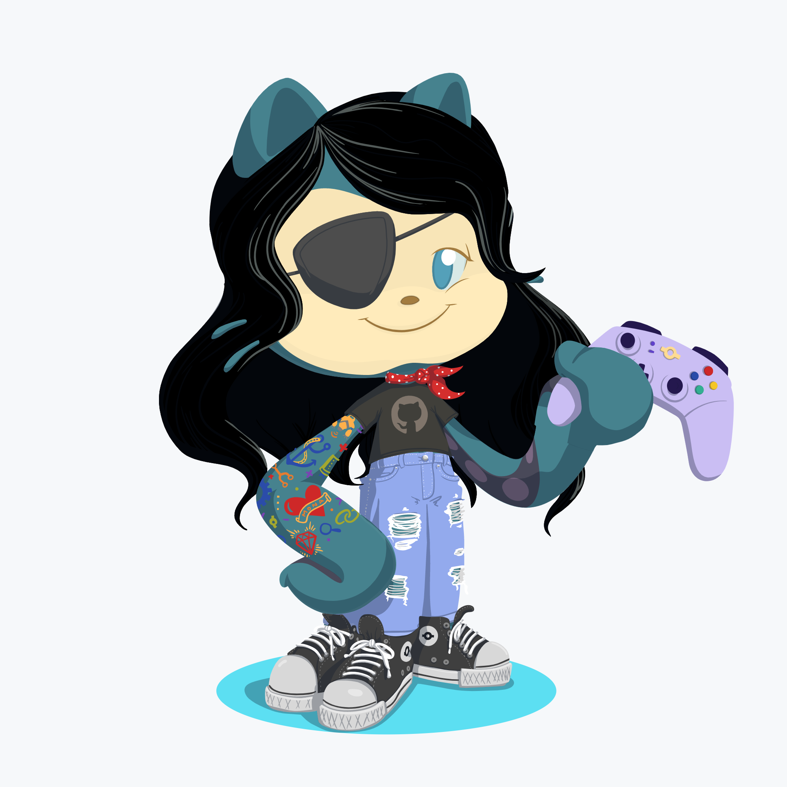

### Hi there 👋

 1) I’m currently working on Machine learning models which can be used for API creation, Learning More about Data science. 
 2) I’m looking to collaborate on Community building and also open to any freelancing  & volunteering opportunities. 
 3) Ask me about Comics, movies, Series, POP-CULTURE i know it all.
 4) Hobbies: I love writing my own thoughts, discussing on polical and cultural views, gardening and a Neat freak. 
 5) Fun fact: I am  all in one package.
 
 (*) Connect with me: [Namratha L B](https://www.linkedin.com/in/namratha-l-bemane-a868b7162/)

 
 [
 
<!--

<!--
**Namrathalb/Namrathalb** is a ✨ _special_ ✨ repository because its `README.md` (this file) appears on your GitHub profile.

<!--Here are some ideas to get you started:-->
